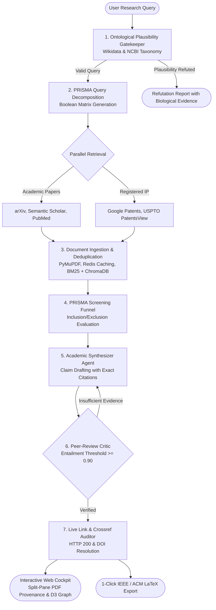

# VERITAS 🔬✨
> **Verified Evidence-Based Research, IP & Autonomous Synthesis System**

[](LICENSE)
[](https://python.org)
[](https://fastapi.tiangolo.com)
[](https://nextjs.org)
[](https://langchain-ai.github.io/langgraph/)
[](CONTRIBUTING.md)

VERITAS is an open-source, closed-loop multi-agent AI research platform engineered to eliminate scientific hallucinations. By pairing automated systematic review protocols (**PRISMA 2020**) with dual literature-patent discovery and zero-trust source verification, VERITAS produces production-grade research syntheses with provable provenance.

---

## ⚡ The Problem: Why VERITAS?

Current generative AI tools and conversational search engines suffer from critical failure modes in academic and enterprise R&D:
* **Fabricated Citations:** Inventing non-existent papers, fake DOIs, and imaginary author pairings.
* **Dead Links & Rot:** Producing links that yield HTTP 404/403 errors or lead to predatory journal domains.
* **Ungrounded Premises:** Answering scientifically nonsensical or biologically impossible queries without scrutiny.
* **Siloed Literature & IP:** Treating academic discovery and patent landscaping as disconnected tasks.

### 🛡️ The Solution
VERITAS implements a **zero-trust verification pipeline**. Every claim generated by the system is cross-examined against extracted PDF passages, validated against official registry APIs (Crossref, PubMed, USPTO), and verified with active HTTP 200 checks before it reaches the final document.

---

## 🚀 Key Features

* 🧠 **Ontological Plausibility Gatekeeper:** Intercepts ungrounded or scientifically impossible prompts using Wikidata SPARQL and NCBI Taxonomy graphs before retrieval begins.
* 📋 **PRISMA 2020 Systematic Review Engine:** Decomposes research questions into Boolean query matrices across multiple databases, executing strict 4-stage screening and deduplication funnels.
* 🌐 **Dual Literature & Patent Landscaping:** Unifies scientific publications (arXiv, Semantic Scholar, PubMed) with registered intellectual property (Google Patents, USPTO PatentsView) to reveal white spaces and commercialization avenues.
* 🔒 **Zero-Trust Source Verifier:** Continuously audits all citations with real-time HTTP 200 pinging and Crossref REST API metadata matching to guarantee 100% active, authentic sources.
* 🎛️ **Interactive Research Cockpit:** Modern Next.js interface with real-time agent telemetry, a synchronized split-pane claim inspector with highlighted source PDF provenance, and an interactive D3.js citation network.
* 📑 **One-Click Publication Export:** Compiles structured literature surveys into publication-ready IEEE and ACM LaTeX packages, bundled with complete, validated `.bib` bibliographies.

---

## 🏗️ Architecture & Agent Flow



---

## 👥 Core Team & Maintainers

VERITAS is built and maintained by the **Code Blooded** engineering team:

| Contributor | Role | Core Focus |
| :--- | :--- | :--- |
| **Pritam Jana** | Project Lead & Agent Architect | LangGraph Cyclical Orchestration, State Machines & Critic Loops |
| **Sachin Kumar Singh** | Full-Stack & Interface Lead | Next.js Research Cockpit, Graph Telemetry & Real-Time UX |
| **Rohit Kumar Ojha** | Data Ingestion & Pipeline Lead | Academic Ingestion APIs, Patent Connectors & PDF Parsers |
| **Sagar Jha** | Review Protocol Lead | PRISMA 2020 Review Engine & Ontological Gatekeeper |
| **Bhaskar Raj** | Verification & Export Lead | Live Link Auditor, IP Copyright Engine & LaTeX Compiler |

---

## 💻 Tech Stack

### Frontend & Cockpit
* **Framework:** Next.js 14 (App Router), React 18, TypeScript
* **Styling:** TailwindCSS, Lucide Icons, Radix UI primitives
* **Visualizations:** D3.js (Force-directed citation & patent graph)
* **Streaming:** Server-Sent Events (SSE) & WebSockets

### Backend & Agents
* **Server:** FastAPI (Python 3.10+), Uvicorn, Pydantic v2
* **Agent Framework:** LangGraph (StateGraph cyclical DAG), LangChain
* **Task Queue & Caching:** Redis, Celery
* **Retrieval & Embeddings:** ChromaDB, BM25 Hybrid Retriever, Sentence-Transformers
* **Document Processing:** PyMuPDF (fitz), Crossref API, aiohttp

---

## 🛠️ Getting Started

### Prerequisites
* Python 3.10+
* Node.js 18+ & npm / pnpm
* Redis (optional for caching)

### 1. Clone the Repository
```bash
git clone https://github.com/Code-Blooded-CS/VERITAS.git
cd VERITAS
```

### 2. Backend Setup
```bash
cd backend
python -m venv venv
# On Windows:
.\venv\Scripts\activate
# On Linux/macOS:
source venv/bin/activate

pip install -r requirements.txt
uvicorn app.main:app --reload --port 8000
```

### 3. Frontend Setup
```bash
cd ../frontend
npm install
npm run dev
```
Open [http://localhost:3000](http://localhost:3000) in your browser to access the VERITAS Research Cockpit.

---

## 🌿 Contribution Workflow

We follow standard trunk-based development with feature branches:

1. **Create your feature branch:**
   ```bash
   git checkout -b feature/your-feature-name
   ```
2. **Commit changes with descriptive messages:**
   ```bash
   git commit -m "feat(module): add semantic patent similarity search"
   ```
3. **Push to GitHub and submit a Pull Request:**
   ```bash
   git push -u origin feature/your-feature-name
   ```
4. PRs must pass linting and receive at least one code review before merging into `main`.

---

## 📜 License

This project is licensed under the **MIT License** — see the [LICENSE](LICENSE) file for details.
