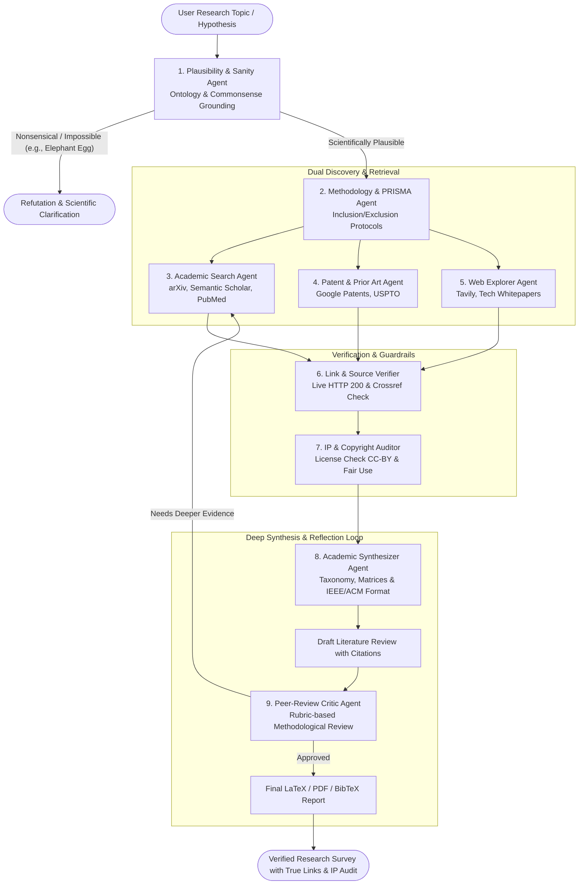

# PROJECT SYNOPSIS

## 1. Project Title
**VERITAS: A Verified Evidence-Based Multi-Agent Framework for Literature Discovery, Patent Landscaping, and Automated Academic Synthesis**  
*Sub-title: A Closed-Loop Agentic System for Deep Synthesis, Bibliometric Traversal, and Hallucination-Free Academic Reporting*

### Team & Faculty Details
* **Department:** Computer Science and Engineering
* **Team Name:** `Code Blooded`
* **Team Leader:** **Pritam Jana**
* **Team Members:**
  1. **Pritam Jana** (Team Leader) — Roll No: `25500123099`
  2. **Sachin Kumar Singh** — Roll No: `25500123122`
  3. **Rohit Kumar Ojha** — Roll No: `25500123118`
  4. **Sagar Jha** — Roll No: `25500123124`
  5. **Bhaskar Raj** — Roll No: `25500123061`
* **Project Supervisor / Guide:** **Prof. (Dr.) Amitava Halder** (Dept. of Computer Science & Engineering)
* **Head of Department (HoD):** **Prof. (Dr.) Amrut Ranjan Jena** (Dept. of Computer Science & Engineering)

---

## 2. Executive Summary & Problem Context
While generative Large Language Models (LLMs) can summarize text, standard single-agent systems suffer from hallucinated citations, shallow synthesis, and a critical lack of research methodology. Most dangerously, generic AI models suffer from **gullibility bias**: when prompted with biologically or physically impossible queries (e.g., *"an elephant hatching an egg"*), they synthesize pseudoscientific reviews instead of verifying scientific plausibility.

Furthermore, traditional AI tools ignore:
1. **Formal Research Methodologies:** Disregard for established frameworks like **PRISMA** (Preferred Reporting Items for Systematic Reviews and Meta-Analyses), lacking explicit inclusion/exclusion screening and risk-of-bias criteria.
2. **Intellectual Property (IP), Patents & Copyright:** Neglect of patent prior art (USPTO, Google Patents), open-access license boundaries (e.g., CC-BY vs. proprietary data), and fair-use guidelines.
3. **Source Provenance & Dead Links:** Hallucinating nonexistent DOIs, broken URLs, and fake author attributions.

**VERITAS** solves these core flaws by establishing an autonomous, multi-agent AI research assistant with strict academic gatekeeping, live link verification, and patent prior-art integration.

---

## 3. Core Objectives
1. **Premise Plausibility & Anti-Nonsense Filtering:** Implement an ontology-driven semantic verification gatekeeper that evaluates whether an input topic is scientifically grounded before executing downstream workflows.
2. **PRISMA-Compliant Research Methodology:** Automate systematic review protocols following PRISMA standards (search strings, inclusion/exclusion eligibility matrices, synthesis tables).
3. **Dual Academic & Patent Prior-Art Discovery:** Search peer-reviewed literature (arXiv, Semantic Scholar, PubMed, Crossref) and patent databases (Google Patents, USPTO) to identify both theoretical foundations and existing IP.
4. **Guaranteed Source & Link Truthfulness:** Perform live asynchronous HTTP status checks (200 OK) and Crossref metadata cross-matching on all cited DOIs and URLs—ensuring zero dead links or fabricated citations.
5. **IP, Copyright & Fair-Use Compliance:** Safeguard against copyright violations by auditing open-access license statuses and checking syntactic overlap.
6. **Publication-Grade Formatting:** Export survey reports directly into IEEE/ACM-compliant LaTeX, PDF, and authenticated `.bib` bibliographies.

---

## 4. Multi-Agent Architecture & Specialized Roles

### Agent Roles & Responsibilities

| # | Agent Name | Core Functionality | Tooling & Standards |
| :--- | :--- | :--- | :--- |
| **1** | **Plausibility & Sanity Agent** | Intercepts nonsensical, pseudoscientific, or impossible queries before research begins. Returns a grounded refutation if invalid. | Scientific Knowledge Graphs, Biological/Physical Taxonomies, Natural Language Inference. |
| **2** | **Methodology & PRISMA Agent** | Establishes formal research protocols, Boolean search strategies, and systematic inclusion/exclusion criteria. | PRISMA 2020 Guidelines, Search Strategy Matrix. |
| **3** | **Academic Search Agent** | Queries peer-reviewed journals and preprint archives for metadata, abstracts, and full texts. | Semantic Scholar (S2AG), arXiv API, PubMed API, Crossref API. |
| **4** | **Patent & Prior-Art Agent** | Searches registered patents to identify technological prior art, claimed inventions, and assignee landscapes. | Google Patents Public Data, USPTO PatentsView API. |
| **5** | **Source & Link Verifier Agent** | Confirms DOI existence, verifies live HTTP status (200 OK), and tests that cited authors/venues exist. | DOI Resolver (`doi.org`), Asynchronous `aiohttp` Pinger, Crossref Metadata Validator. |
| **6** | **IP & Copyright Compliance Agent** | Audits licensing rights (CC-BY vs. All Rights Reserved), verifies fair-use citation lengths, and prevents verbatim copying. | Creative Commons API, N-gram Plagiarism / Overlap Checker. |
| **7** | **Synthesis & Writer Agent** | Compiles verified evidence into structured academic sections (Taxonomy, Comparison Tables, Research Gaps). | Academic Prompting, IEEE/ACM LaTeX Engine, BibTeX Builder. |
| **8** | **Peer-Review Critic Agent** | Evaluates drafts against rigorous academic criteria (logical flow, completeness of prior art, empirical evidence). | Multi-Agent Reflexion Loop, Rubric-based Scoring Engine. |

---

## 5. Methodological & Legal Guarantees

### A. The "Anti-Nonsense" Ontological Filter
When presented with an inquiry such as *"Elephant hatching an egg"*:
1. The **Plausibility Agent** queries scientific taxonomies (NCBI Taxonomy, Wikidata).
2. It detects an ontological contradiction: *Loxodonta* $\in$ *Mammalia* (viviparous organism), whereas egg-hatching $\in$ *Oviparous organisms*.
3. Instead of hallucinating speculative papers, the system terminates the review loop and returns a formal, citation-backed scientific explanation detailing why the premise is biologically impossible.

### B. PRISMA Systematic Review Workflow
1. **Identification:** Automated search across all connected academic & patent engines.
2. **Screening:** Deduplication and abstract filtering against inclusion criteria.
3. **Eligibility:** Full-text evaluation to confirm empirical methodology and benchmark results.
4. **Included:** Final corpus synthesized into comparative matrices.

### C. 100% Verified Sources & Live Links
* Every cited DOI is queried asynchronously against `https://doi.org/<DOI>`.
* The HTTP response header must return status `200` or `302` redirecting to an active publisher page.
* The paper title and author list returned by the Crossref API must match the cited reference.
* If a reference fails, it is purged from the bibliography.

### D. Intellectual Property (IP) & Patent Landscaping
* Identifies existing patent claims to ensure proposed research ideas do not infringe on registered commercial intellectual property.
* Distinguishes between Open Access (CC-BY / MIT) and proprietary protected texts.

### E. Web-Based Platform Architecture & Research Cockpit
* **Real-Time Agent Telemetry:** Live streaming of agent reasoning steps, queries, and chunk scores via WebSockets / Server-Sent Events (SSE).
* **Split-Pane Provenance Inspector:** Clicking any statement in the generated review automatically highlights the verified source passage in the embedded PDF viewer with its live HTTP 200 verification badge.
* **Interactive D3.js Citation Graph:** Interactive, force-directed network showing paper co-citations, seminal authors, and patent connections.
* **Asynchronous Task Queue (FastAPI + Celery/Redis):** Prevents timeout errors during 2–4 minute deep research loops, providing stateful checkpoints where users can pause and edit search parameters.
* **1-Click Export Gateway:** Generates downloadable IEEE/ACM LaTeX ZIP packages, compiled PDFs, and BibTeX files.

### F. Loop Engineering (Closed-Loop Reflection & Verification)
* **Breaking the Open-Loop Trap:** Standard LLMs produce text autoregressively without post-generation validation. VERITAS introduces formal **Loop Engineering**, establishing an active feedback loop between the Synthesizer and Critic agents.
* **Entailment Convergence:** If a claim's natural language inference (NLI) score falls below threshold $\tau = 0.90$, or if the Critic flags an evidence gap, the system backtracks and triggers secondary targeted retrieval until empirical convergence is reached.

### G. Dynamic Capability Injection & CDP Browser Transport
* **Capabilities over Modes:** Rather than running all tools on every prompt, the supervisory orchestrator injects modular skills on-demand (e.g., PubMed skill for biological queries, USPTO skill for novel algorithms/hardware).
* **CDP-Driven Browser Navigation:** For complex academic and patent portals that rely on client-side JavaScript hydration (e.g., IEEE Xplore, Google Patents), the Web Agent uses Chrome DevTools Protocol (CDP) with liveness and readiness verification to guarantee complete, clean DOM extraction.

---

## 6. Technology Stack
* **Frontend Cockpit:** Next.js 14, React, TailwindCSS, D3.js (Interactive Graph), Lucide Icons
* **Backend & Real-Time Gateway:** FastAPI (Python 3.10+), WebSockets / SSE, Uvicorn
* **Task Queue & Cache:** Celery, Redis (for asynchronous long-running research jobs & checkpoints)
* **Agent Orchestration:** LangGraph (StateGraph cyclical workflow with human-in-the-loop)
* **Language Models:** Gemini 1.5 Pro / GPT-4o (Reasoning & Plausibility), Llama 3 via Ollama (Chunk Extraction)
* **Academic & Patent APIs:** Semantic Scholar API, arXiv API, Crossref REST API, PubMed API, Google Patents / USPTO
* **Link & Source Validation:** `aiohttp` async pinger, official DOI resolver proxy, Crossref content negotiation
* **Document Processing & IP:** PyMuPDF, Spacy (semantic overlap checking for copyright compliance)
* **Evaluation Framework:** RAGAS (Faithfulness, Context Recall) and PRISMA 2020 Checklist compliance
* **Export Pipeline:** Automated IEEE/ACM LaTeX compilation, PDF, and verified `.bib` collection

---

## 7. Official 5-Page University Synopsis Layout

| Page # | Core Sections Included | Visuals & Tables |
| :---: | :--- | :--- |
| **Page 1** | Title Block, Team `Code Blooded`, Roll Nos, Faculty (Guide & HoD), Abstract, Introduction, Problem Statement, Objectives | Single-column Header & Faculty Block |
| **Page 2** | Proposed Architecture, Specialized Agent Roles, Collaborative Lifecycle | **Table 1:** Agent Roles (8 agents) **Figure 1:** Multi-Agent StateGraph Workflow |
| **Page 3** | Methodology & Scientific Rigor, Plausibility (Eq 1), PRISMA 2020 Protocol, Loop Engineering (Eq 2), Dynamic Capabilities | **Figure 2:** PRISMA Systematic Screening Funnel |
| **Page 4** | Web Platform Architecture, Live Verification (Eq 3), Formal Verification Guarantees & Theoretical Complexity | **Figure 3:** Web Research Cockpit Mockup |
| **Page 5** | Technology Stack, Expected Deliverables, 6-Month Project Work Plan & Milestones, Conclusion & Future Scope, References | **Table 2:** 6-Month Milestone Schedule 8 Authenticated Academic References |
